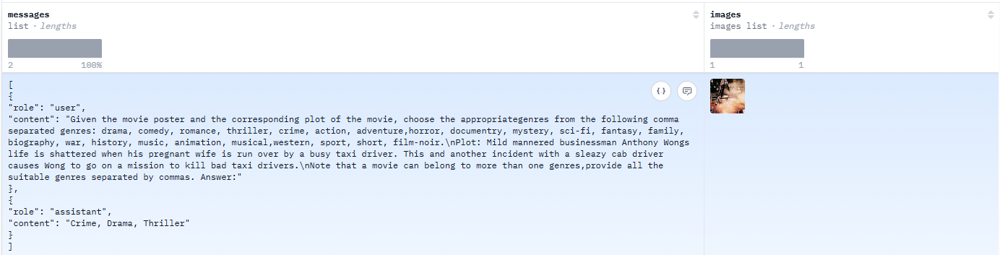
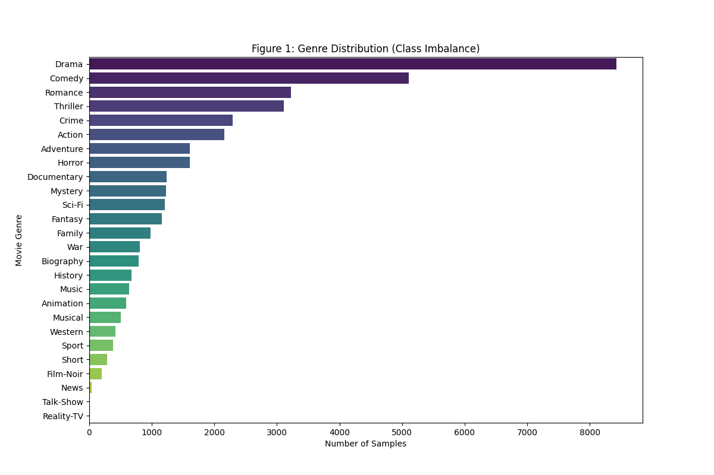
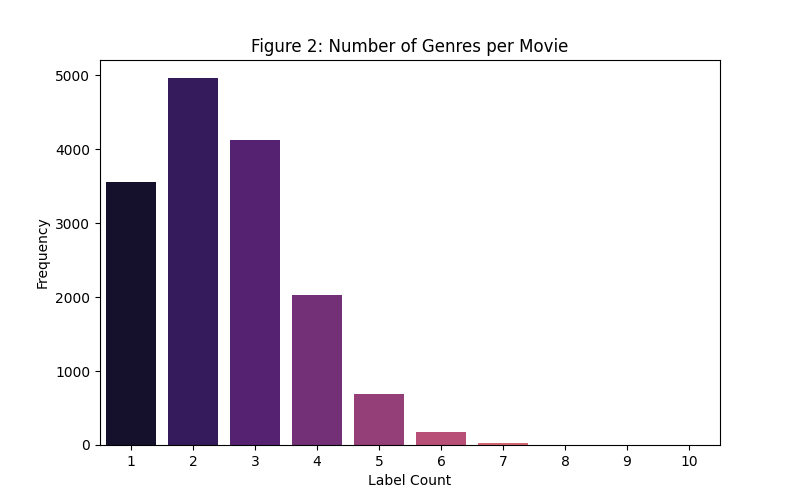
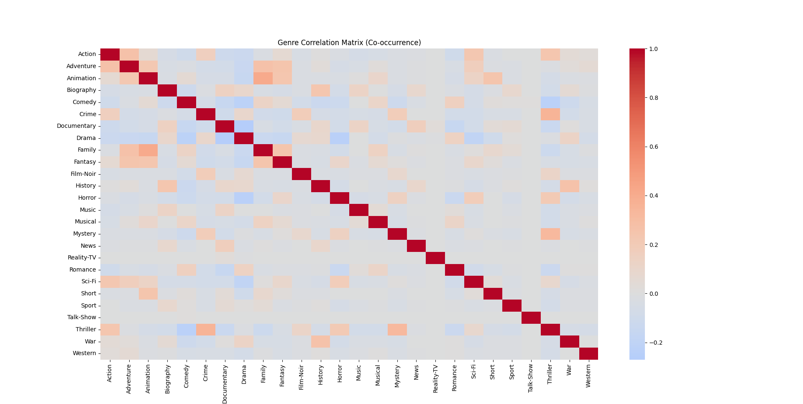
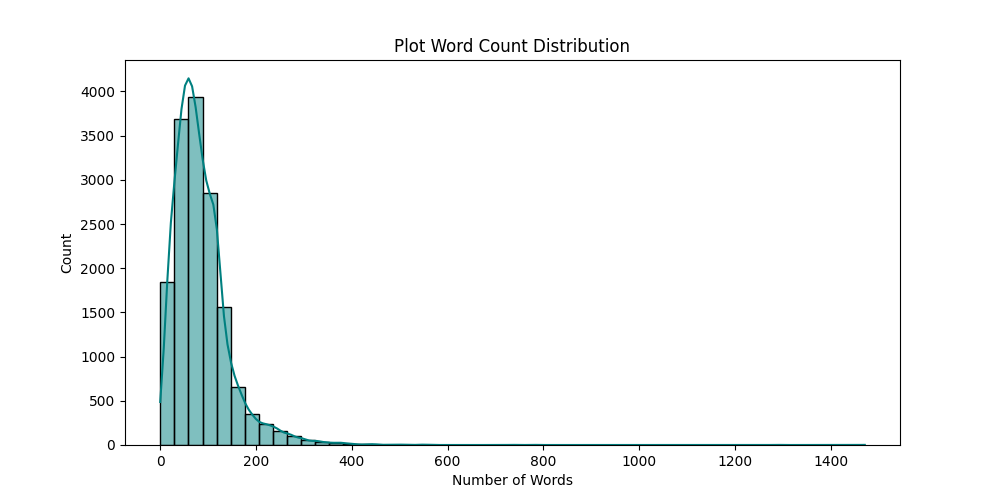

# Multimodal Dataset Classification

**Group:** LTH (252)  
**Course:** Deep Learning (CO3021)  
**Institution:** Ho Chi Minh City University of Technology (HCMUT)

---

## 1. Dataset Exploration & Preprocessing

### 📊 Dataset Overview: MMIMDb

The project utilizes the **MMIMDb (Multi-Modal IMDb)** dataset, a standard benchmark for multimodal classification tasks. The primary objective is to predict movie genres by integrating visual information (movie posters) and textual information (plot summaries).

- **Data Source:** [Hugging Face - MMIMDb Dataset](https://huggingface.co/datasets/sxj1215/mmimdb)
- **Problem Type:** Multi-label classification

#### Key Statistics:

| Metric                      | Value                              |
| :-------------------------- | :--------------------------------- |
| **Total Samples**           | 15,552                             |
| **Unique Classes (Genres)** | 26                                 |
| **Modalities**              | Visual (Posters) & Textual (Plots) |

#### Data Characteristics:

- **Textual Data:** The `plot` attribute provides a concise summary of the movie's main storyline.
- **Visual Data:** The `images` attribute contains official movie posters, reflecting the artistic style and color palette characteristic of each genre.
- **Label Distribution:** The most frequent genres are **Drama** (8,424 samples), **Comedy** (5,108 samples), and **Romance** (3,226 samples).

---

### 🖼️ Dataset Preview

The MMIMDb dataset structure combines textual content with visual imagery:

  
_Figure 1: Preview of the MMIMDb dataset structure displaying plot summaries and corresponding movie posters._

---

## 2. In-depth Exploratory Data Analysis (EDA)

To understand the complexity of the MMIMDb dataset, we conducted a comprehensive analysis focusing on label distribution, multi-label characteristics, and textual features.

### 📊 Genre Distribution & Class Imbalance

Analysis of the 26 unique genres reveals a significant **Long-tail distribution**. Dominant genres comprise the majority of the dataset, while niche genres like _Film-Noir_ have significantly fewer samples, presenting a challenge for model convergence.

  
_Figure 2: Distribution of samples across 26 movie genres, highlighting the class imbalance._

### 🏷️ Multi-label Characteristics

MMIMDb is inherently multi-label. Our analysis shows that most movies are associated with **2 to 3 genres** simultaneously. This overlap requires the model to capture complex relationships between different categories.

  
_Figure 3: Frequency of the number of labels assigned per movie._

### 🔗 Genre Correlation (Co-occurrence)

The correlation matrix visualizes how genres frequently appear together (e.g., _Action_ often co-occurs with _Adventure_). Understanding these dependencies is crucial for the **Joint Embedding** strategy.

  
_Figure 4: Heatmap illustrating the co-occurrence patterns between genres._

### 📝 Textual Feature Analysis

We analyzed the word count distribution of the movie plots. This guided our decision on the `max_length` parameter for the DistilBERT tokenizer to ensure context isn't truncated.

  
_Figure 5: Distribution of word counts in movie plot summaries._

---

[⬅️ Back to README](./README.md)
